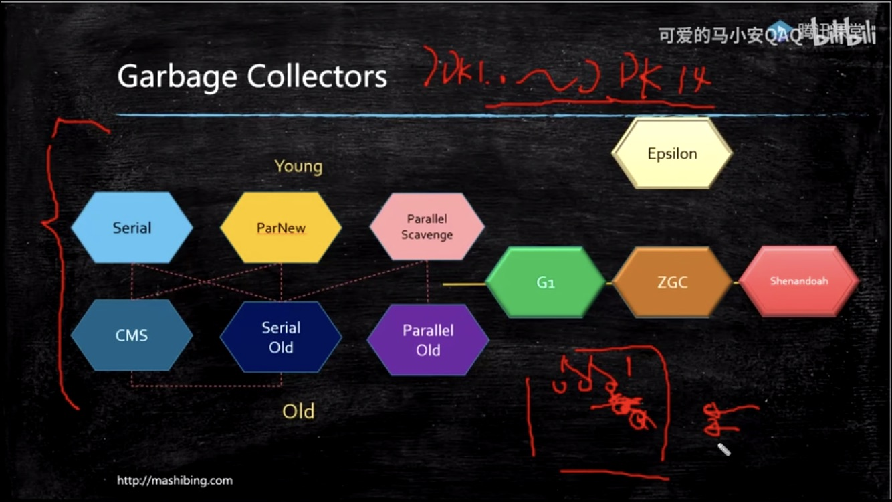

## 垃圾回收器

Minor GC
	Serial 				复制算法，单线程收集器
	ParNew 				多线程收集器，Seria的多线程版本
	Parallel Scavenge 	多线程，复制算法，适合搞吞吐量的后台运算系统，不合适部分偏重交互和用户体验的系统使用，且不能和CMS搭配使用

Major GC/Full GC
	Serial Old 			单线程，标记-整理算法
	Parallel Old 		多线程，标记-清楚算法，是PS的多线程版本
	CMS					多线程，标记-清楚,获取最短回收停顿时间