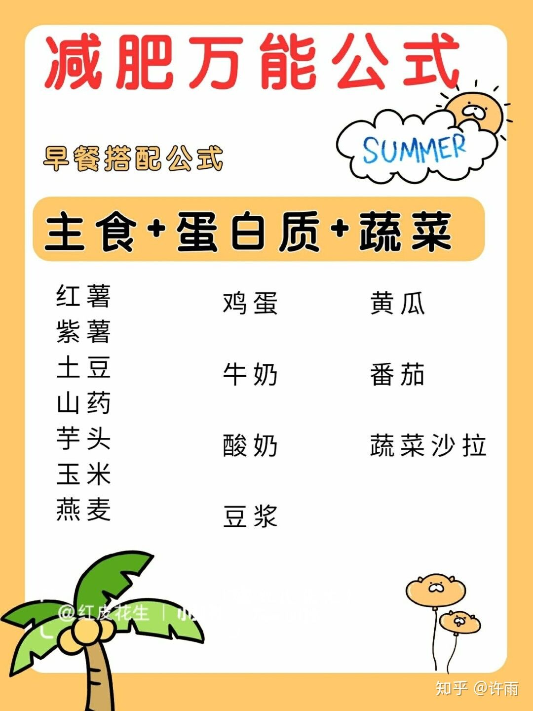
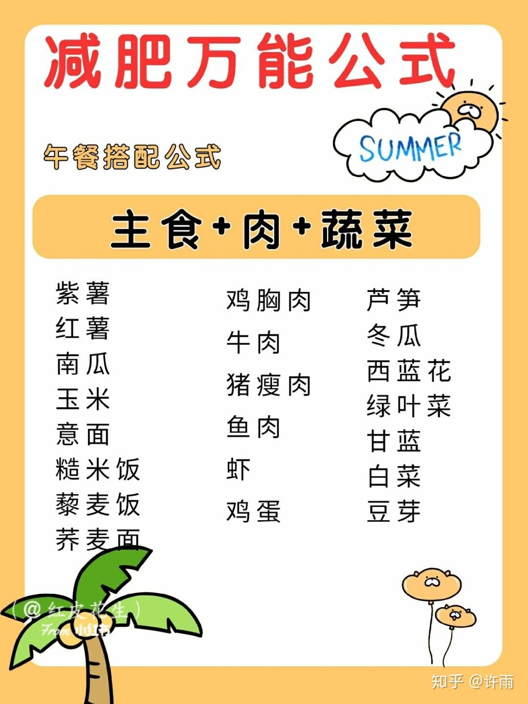
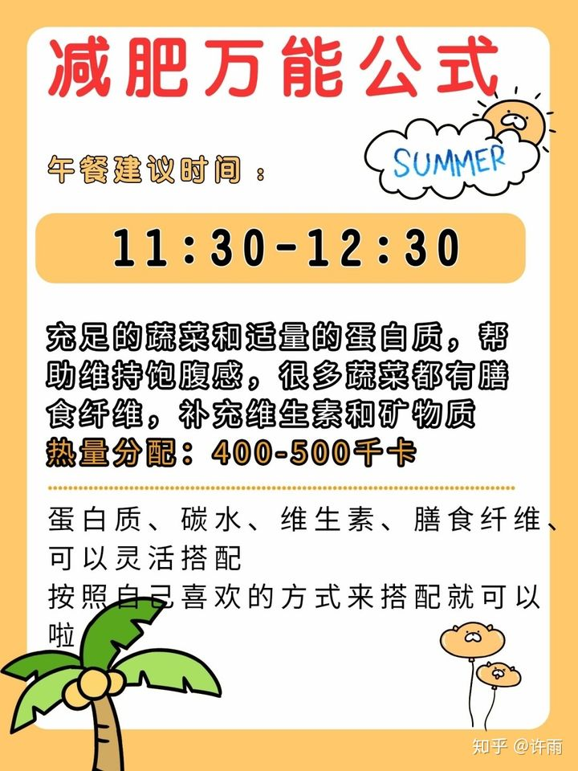
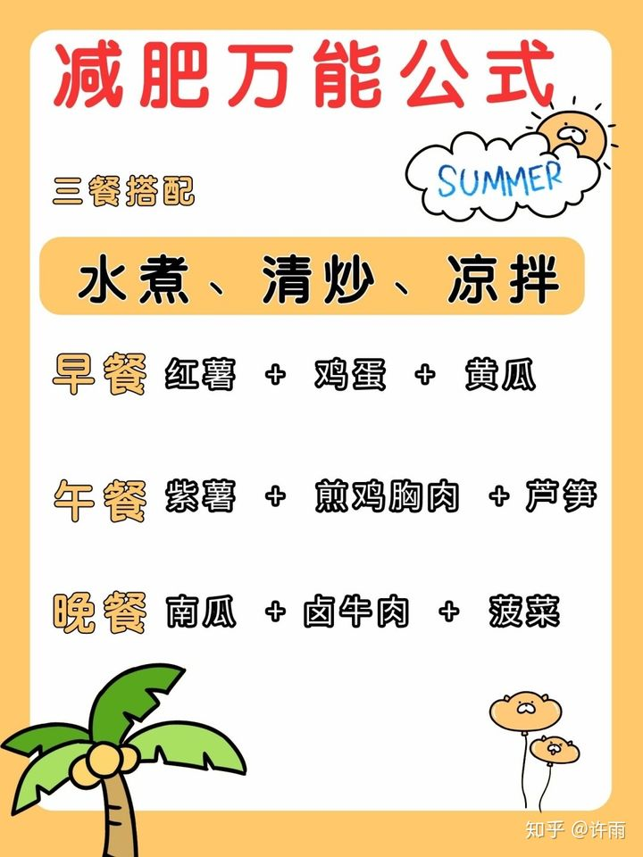

### 购买清单

* **主食**

  全麦面包

  玉米

  红薯

  燕麦

  糙米

* **肉蛋奶**

  鱼肉（龙利鱼、巴沙鱼）

  鸡胸肉

  鸡蛋

  水煮蛋

  脱脂牛奶

  豆浆

  

  

* **水果**

  西红柿

  苹果

  香蕉

* **蔬菜**

  菠菜

  黄瓜

  西蓝花

  芹菜

  生菜

  土豆

  豆芽

  洋葱

* **调料**

  盐

  黑胡椒粉

---

每餐搭配原则

---

### 每餐搭配

**搭配原则，每顿饭都有优质碳水、优质蛋白质、新鲜蔬菜这三样东西。**

#### 星期一

* **早餐**

  白水煮鸡蛋：1 个

  全麦面包：1 片 （可用杂粮馒头 1 个替代）
  牛奶：1 杯约 250ml （全脂脱脂均可）
  西红柿：1 个（或等量其它蔬菜）

* **午餐**

  煎鸡胸：1 块约 150g（或等量其它瘦肉类菜肴）
  蒜蓉西兰花：1 个约 200g（或等量其它蔬菜）
  米饭：1 碗约 100g（或等量馒头、面条）

* **晚餐**

  卤牛肉：1 份约 100g（或其它瘦肉类菜肴替代）
  香菇油菜：1 份约 200g（或等量其它蔬菜）
  红薯或紫薯：1 块约 100g（或等量其它粗粮）

#### 星期二

* **早餐**

  白水煮鸡蛋：1 个
  玉米：1 根
  牛奶：1 杯约 250ml （全脂脱脂均可）
  坚果：1 小把

* **午餐**

  鸡腿：2 根（鸡腿去皮，或等量其它瘦肉 ）
  爆炒圆白菜：1 份约 200g（或等量其它蔬菜）
  馒头：1 个

* **晚餐**

  清炒虾仁：1 份约 100g（或等量其它瘦肉）
  拍黄瓜：1 份约 200g（或等量其它蔬菜）
  粗粮米饭：1 碗约 50g

#### 星期三

* **早餐**

  茶叶蛋：1 个
  苹果：1 个
  牛奶：1 杯约 250ml （全脂脱脂均可）
  小米粥：1 碗

* **午餐**

  凉拌鸡胸丝：1 块约 150g（或等量其它瘦肉）
  西红柿炒鸡蛋：1 份约 200g（或等量其它蔬菜）
  米饭：1 碗约 100g

* **晚餐**

#### 星期四

* **早餐**

  白水煮鸡蛋：1 个
  全麦面包：1 片 （可用杂粮馒头 1 个替代）
  牛奶：1 杯约 250ml （全脂脱脂均可）
  西红柿：1 个（或等量其它蔬菜）

* **午餐**

  煎鸡胸：1 块约 150g（或等量其它瘦肉类菜肴）
  蒜蓉西兰花：1 个约 200g（或等量其它蔬菜）
  米饭：1 碗约 100g（或等量馒头、面条）

* **晚餐**

  煎牛排：1 份约 100g（或其它瘦肉类菜肴替代）
  炒菠菜：1 份约 200g（或等量其它蔬菜）
  红薯或紫薯：1 块约 100g（或等量其它粗粮）

#### 星期五

* **早餐**

  白水煮鸡蛋：1 个
  玉米：1 根
  牛奶：1 杯约 250ml （全脂脱脂均可）
  坚果：1 小把

* **午餐**

  鸡腿：2 根（鸡腿去皮，或等量其它瘦肉 ）
  爆炒圆白菜：1 份约 200g（或等量其它蔬菜）
  馒头：1 个

* **晚餐**

  清炒虾仁：1 份约 100g（或等量其它瘦肉）
  拍黄瓜：1 份约 200g（或等量其它蔬菜）
  粗粮米饭：1 碗约 50g

#### 星期六

* **早餐**

  茶叶蛋：1 个
  苹果：1 个
  牛奶：1 杯约 250ml （全脂脱脂均可）
  小米粥：1 碗

* **午餐**

  凉拌鸡胸丝：1 块约 150g（或等量其它瘦肉）
  西红柿炒鸡蛋：1 份约 200g（或等量其它蔬菜）
  米饭：1 碗约 100g

* **晚餐**

#### 星期日

* **早餐**

  煎鸡蛋：1 个
  草莓：5 个
  牛奶：1 杯约 250ml （全脂脱脂均可）
  小米粥：1 碗

* **午餐**

  彩椒炒鸡胸：鸡胸 1 块约 100g，彩椒 1 个
  凉拌西兰花：1 个约 150g（或等量其它蔬菜）
  米饭：1 碗约 100g

* **晚餐**

  小炒牛肉：1 份约 100g（或等量其它瘦肉）
  凉拌木耳：1 份约 150g（或等量其它蔬菜）
  红薯或紫薯：1 块约 50g（或等量其它粗粮）
